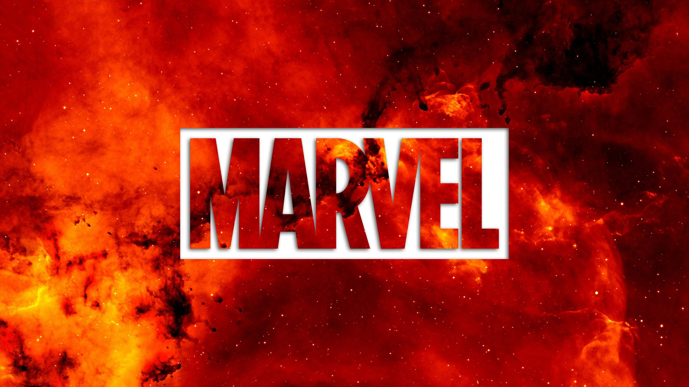
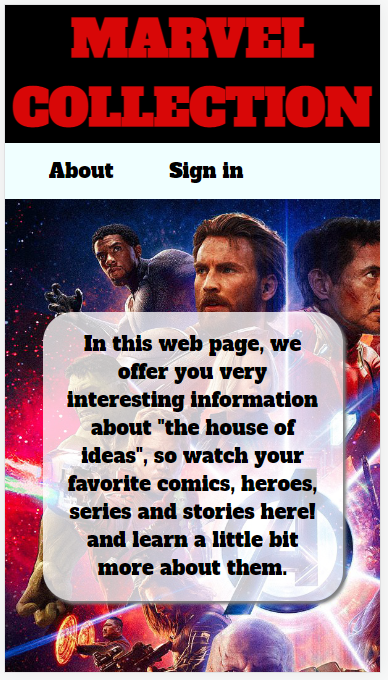

# Reto Marvel

## Descripción

Marvel es una de las más importantes editoriales de historietas estadounidenses a nivel mundial, es considerada la “casa de las ideas” , la cual nos brinda muchas historias, comics, series y personajes famosos desde sus inicios de producción.
En esta página web encontrarás información sobre tus superheroes favoritos, comics y series del universo de Marvel. Disfrútalo. 

## Historias de Usuarios y vista mobile

### Historia 1

- Como usuario quiero una vista que me brinde acceso a poder registrarme o iniciar sesión.
- Como usuario quiero una vista que me muestre un resumen del contenido a mostrar.

  **Criterios de aceptación**

- Vista responsiva que muestre una opción para iniciar sesión o registrarme.
- Vista responsiva que muestre un resumen del contenido.
- Correo y contraseña deben ser validados en ambos formularios.

### Historia 2

- Como usuario ya registrado quiero una vista que me permita iniciar sesión con mi correo y contraseña
- Como usuario no registrado quiero una vista que me permita registrarme con mi correo y contraseña.

  **Criterios de aceptación**

- Vista responsiva que muestre un formulario para iniciar sesión.
- Vista responsiva que muestre un formulario para registrarme.

### Historia 3

- Como usuario ya registrado quiero una vista que me permita ver los cómics.
- Como usuario ya registrado quiero una vista que me permita ver los personajes.
- Como usuario ya registrado quiero una vista que me permita ver los series.
- Como usuario ya registrado quiero una vista que me permita ver las historias.

  **Criterios de aceptación**

- Vista que me permita ver los cómics.
- Vista que me permita ver los personajes.
- Vista que me permita ver las series.
- Vista que me permita ver las historias.

## Vista Desktop

